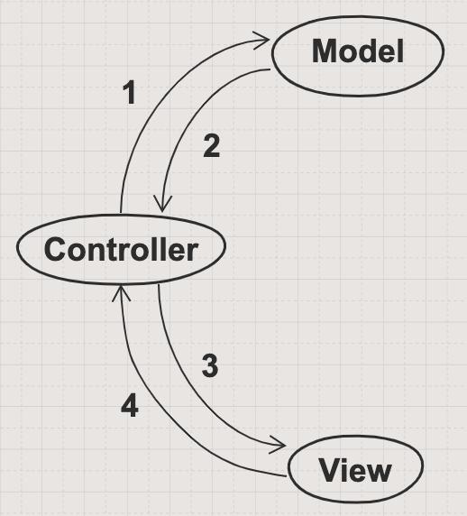

# Flask Recap

This week we've built out the back end of an app and added data persistence in the form of PostgreSQL. This week we've been building the `M` in MVC.

Our next step will be to add Flask. Flask will provide us with the `V` and the `C`.

Let's review what Flask is and where it will fit in our applications.

Flask is a web framework for building web applications with Python. 

## Task

Your task is to review the Events App that we built last week. Ask yourself the following questions:

1. What does the directory structure look like? 
2. What are the different parts that make up the app?
3. What are controllers responsible for?
4. What are templates responsible for?
5. What is the static folder for?
5. How do you think we will combine what we've done this week with Flask?
6. How do you create a `route` in the controller?
7. The `models/events.py` file acted as some dummy data for our app. This will no longer be necessary. Why is that the case?

